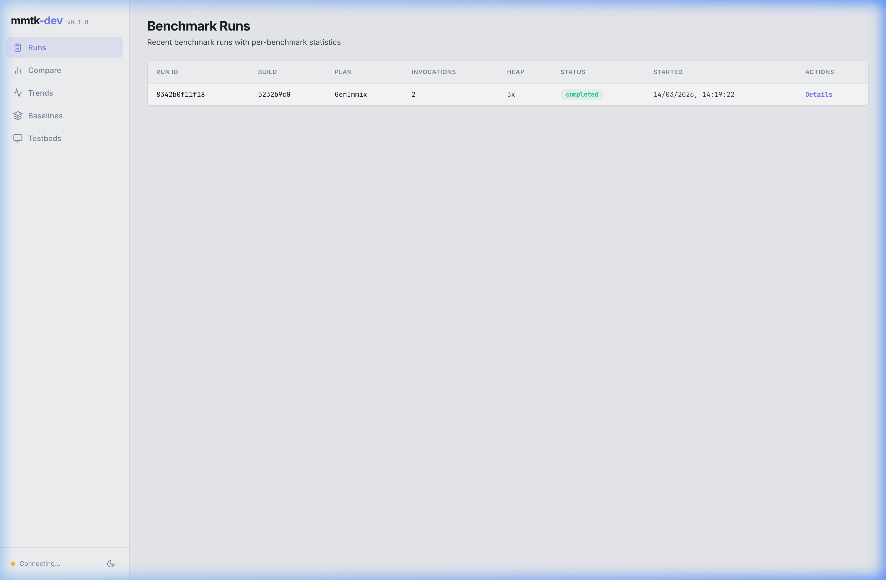
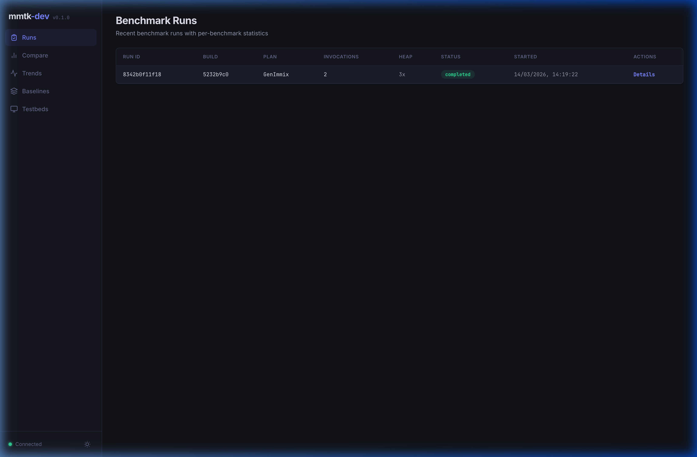
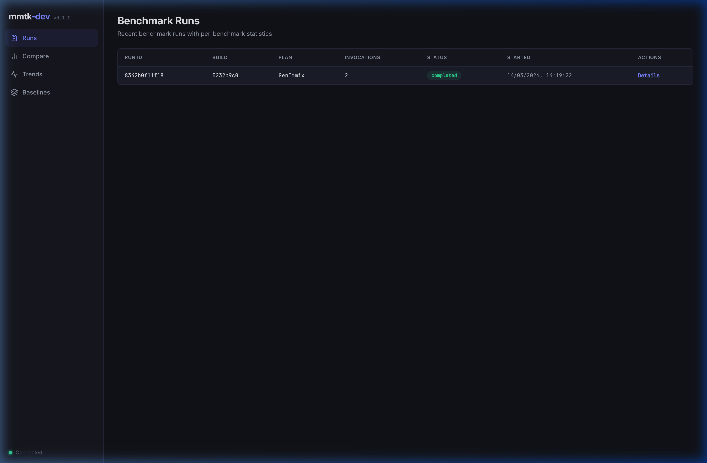
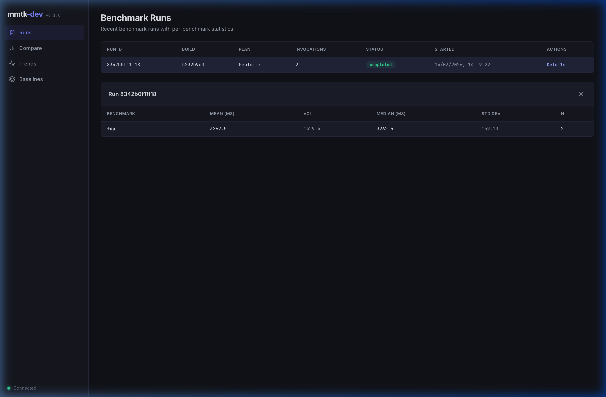
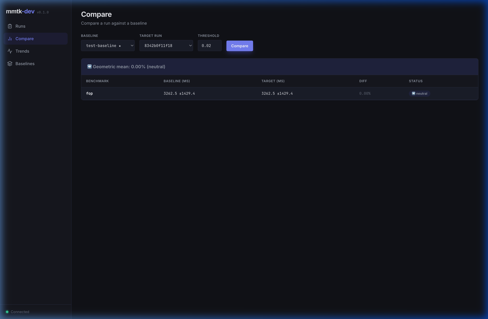
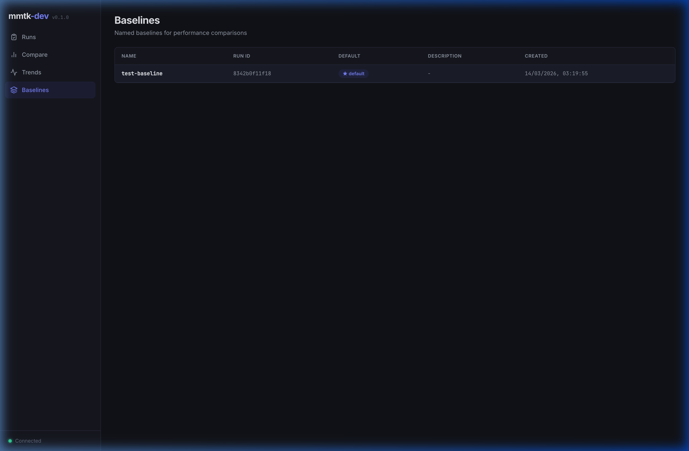

# Web Dashboard

mmtk-dev includes a web dashboard for visualizing benchmark results, comparing runs, and tracking performance trends.

## Starting the Server

```bash
cd /path/to/workspace   # directory containing .mmtk-dev.toml
uv run --project mmtk-core/tools/mmtk-dev mmtk-dev server
```

This will:
1. Install frontend dependencies (first time only)
2. Build the React frontend
3. Start the FastAPI server at http://127.0.0.1:8080

Options:
- `--port <n>` — Change the port (default: 8080)
- `--host <addr>` — Change the bind address (default: 127.0.0.1)
- `--skip-build` — Skip the frontend build step (useful if already built)
- `--db <path>` — Use a custom database path

## Light / Dark Mode

The dashboard auto-detects your system's color scheme (light or dark) on first load. Use the sun/moon toggle button at the bottom of the sidebar to switch manually.

| Light Mode | Dark Mode |
|:---:|:---:|
|  |  |

## Dashboard Views

### Runs

The main view lists all benchmark runs with their run ID, build commit, GC plan, heap multiplier, invocation count, status, and start time. Click **Details** to expand per-benchmark statistics.



The detail modal shows per-benchmark statistics including mean execution time, confidence interval, median, standard deviation, and invocation count. When probes are enabled, MMTk statistics (GC count, STW time, etc.) are displayed below the timing table.



### Compare

Compare a run against a named baseline. Select a baseline and target run from the dropdowns, set a regression threshold, and click **Compare**.

The results table shows per-benchmark baseline vs. current times, percentage diff, and a status badge (✅ faster, ❌ slower, ➡️ neutral). A geometric mean summary is displayed at the top.



### Trends

Track performance over time for a specific benchmark. Select a benchmark from the dropdown to see how execution times evolve across runs. The chart renders with a CI (confidence interval) band around the trend line.

### Baselines

View and manage named baselines. Each baseline is associated with a run ID and can be marked as the default for comparisons.



### Testbeds

View information about the machines used for benchmarking. Each testbed shows:
- **CPU Model** — e.g., AMD EPYC 7B13
- **CPU Cores** — number of CPU cores
- **Memory** — total RAM in GB


## API Endpoints

The server exposes a REST API at `/api/`:

| Endpoint | Method | Description |
|----------|--------|-------------|
| `/api/health` | GET | Health check |
| `/api/builds` | GET | List builds |
| `/api/builds/{id}` | GET | Get build details |
| `/api/runs` | GET | List runs (filterable by `build_id`, `testbed_id`) |
| `/api/runs/{id}` | GET | Get run details |
| `/api/runs/{id}/results` | GET | Get per-benchmark results with statistics |
| `/api/baselines` | GET | List baselines |
| `/api/baselines/{name}` | GET | Get baseline details |
| `/api/compare` | GET | Compare runs (`?baseline=&run_id=&threshold=`) |
| `/api/testbeds` | GET | List testbeds |

## Development

The frontend is a React + TypeScript app built with Parcel and styled with Tailwind CSS. Source code is in `frontend/src/`.

```bash
cd frontend
npm install
npm run dev     # dev server at http://localhost:3000
npm run build   # production build to ../src/mmtk_dev/web/dist/
```
